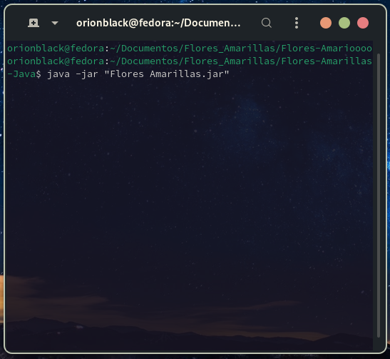

# Flores Amarillas en Java

Un lindo programa escrito en Java por un desarrollador enamorado para regalar flores amarillas cada 21 de Marzo o cada que quieras y cuando quieras. Los girasoles se generan al dar click sobre el campo de girasoles. 

    
    

## Caracteristicas

- **Generación de girasoles infinitos**: Al dar click dentro del campo de girasoles se genera un girasol y puedes generar tantos como quieras.
- **Cierre de aplicación**: El programa se cierra al pulsar la tecla ESC (escape)
- **Recursos empaquetados**: Todos los recursos han sido empaquetados dentro del JAR por lo que no es necesario descargar imágenes por separado. 

## Instrucciones de Ejecución

Para ejecutar este programa se requiere de Java 8 minimo 
1. Clona el proyecto o descarga el codigo
2. Si tienes una instalación activa de Java, solo ejecuta el archivo "Flores Amarillas.jar" con doble click.
3. Puedes ejecutar desde la terminal, navega al directorio clonado o del proyecto y ejecuta con <code>java -jar 'Flores Amarillas.jar'</code>

  

4. Mucha suerte campeon...

## Adicional

- Se requiere Java 8 minimo
- Ejecutable en cualquier sistema operativo con Java

**Notas**: En caso de algun problema o sugerencia no dudes en contactarme

## Contacto

- **TikTok:** @hablemosdec0d3
- **LinkedIn:** https://www.linkedin.com/in/jesus-gonz%C3%A1lez-becerril-a55159244?utm_source=share&utm_campaign=share_via&utm_content=profile&utm_medium=android_app
- **Facebook:** https://www.facebook.com/share/2StcZSxmuFsK1u2N/?mibextid=qi2Omg
- **Gmail:** alexmartinizdominguez@gmail.com
